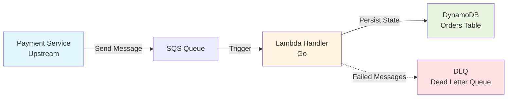

# Fulfillment Service

A serverless order fulfillment service built with AWS Lambda, SQS, and DynamoDB. Designed for handling asynchronous order processing in a travel booking platform with high scalability and fault tolerance.

## Business Context

This service solves the asynchronous fulfillment problem for an online travel platform (similar to Expedia/Ctrip). When a customer completes payment for a travel package (flights + hotel), multiple downstream operations need to happen:

- Issue flight tickets to airline systems
- Confirm hotel reservations
- Send confirmation emails to customers
- Update order status

These operations cannot be done synchronously because:
- Airline APIs are slow (2-5 seconds)
- Hotel systems may be temporarily unavailable
- Synchronous processing would timeout the payment page

## Architecture



**Data Flow:**
1. Payment Service sends `ORDER_PAID` event to SQS
2. Lambda polls SQS and processes messages in batches
3. Lambda validates, checks idempotency, persists to DynamoDB
4. Failed messages (after 3 retries) move to DLQ for manual review

### Core Components

| Component | Purpose | Technology |
|-----------|---------|------------|
| **SQS Queue** | Buffer for order events, handles traffic spikes | Amazon SQS |
| **Lambda Handler** | Consumes messages, executes fulfillment logic | Go + AWS Lambda |
| **DynamoDB** | Stores order state with idempotency guarantees | DynamoDB (NoSQL) |
| **Dead Letter Queue** | Isolates failed messages for manual intervention | SQS DLQ |
| **Infrastructure** | Version-controlled infrastructure as code | Terraform |
| **CI/CD** | Automated testing and deployment | GitHub Actions |

## Technical Decisions

### Why Each Technology?

- **SQS**: Decouples payment service from fulfillment, provides buffering during Black Friday traffic spikes
- **Lambda**: Auto-scales with order volume, zero cost during off-peak hours (3am), pay-per-invocation
- **DynamoDB**: Key-value access pattern (query by OrderID), no complex joins needed, single-digit ms latency
- **DLQ**: Bad message isolation - one corrupted order shouldn't block the entire pipeline
- **Go**: Fast cold starts (~100ms), low memory footprint, strong typing reduces runtime errors

### Idempotency Design

SQS guarantees **at-least-once delivery**, meaning the same message may be received multiple times. To prevent duplicate ticket issuance:

```go
// DynamoDB PutItem with conditional write
PutItemInput{
    Item: order,
    ConditionExpression: "attribute_not_exists(OrderID)",
}
```

- If OrderID already exists → `ConditionalCheckFailedException` → Lambda returns success (silent skip)
- This ensures exactly-once processing semantics

## Order State Machine

```
RECEIVED --> PROCESSING --> COMPLETED
                |
                v
             FAILED --> (Moved to DLQ for manual review)
```

## Implementation Plan

### Phase 1: Core Infrastructure (Terraform)
- [ ] DynamoDB table (OrderID as partition key, Version field for optimistic locking)
- [ ] SQS standard queue with visibility timeout = 30s
- [ ] DLQ with message retention = 14 days
- [ ] Lambda execution role with policies for SQS + DynamoDB

### Phase 2: Lambda Handler (Go)
- [ ] Parse SQS message to Order struct
- [ ] Validate order schema (required fields, amount > 0)
- [ ] Idempotency check via DynamoDB conditional write
- [ ] Persist order state with timestamp
- [ ] Error handling with structured logging

### Phase 3: Testing
- [ ] Unit tests for message parsing
- [ ] Integration test with LocalStack (DynamoDB + SQS)
- [ ] End-to-end test with producer mock

### Phase 4: CI/CD (GitHub Actions)
- [ ] Run tests on every PR
- [ ] Terraform plan preview in PR comments
- [ ] Auto-deploy to staging on merge to `main`
- [ ] Manual approval gate for production deployment

### Phase 5: Observability (Future)
- [ ] CloudWatch metrics (processing latency, DLQ depth)
- [ ] X-Ray tracing for distributed debugging
- [ ] Alarms for DLQ depth > 10

## Project Structure

```
fulfillment-service/
├── cmd/
│   └── producer/          # Mock upstream service (sends test messages to SQS)
│       └── main.go
├── internal/
│   ├── handler/           # Lambda handler logic
│   │   ├── handler.go     # Main handler function
│   │   └── handler_test.go
│   ├── models/            # Order data structures
│   │   └── order.go
│   └── repository/        # DynamoDB operations
│       └── dynamodb.go
├── terraform/
│   ├── main.tf            # Provider and backend config
│   ├── dynamodb.tf        # Table definitions
│   ├── sqs.tf             # Queue + DLQ
│   ├── lambda.tf          # Function + trigger
│   ├── iam.tf             # Roles and policies
│   └── outputs.tf         # Export queue URL, table name
├── .github/
│   └── workflows/
│       ├── test.yml       # Run tests on PR
│       └── deploy.yml     # Terraform apply
├── go.mod                 # Go dependencies
├── go.sum
├── Makefile               # Common tasks (build, test, deploy)
└── README.md
```

## Development Workflow

1. **Local Development**
   ```bash
   make test          # Run unit tests
   make build         # Compile Lambda binary for Linux
   ```

2. **Infrastructure Changes**
   ```bash
   cd terraform
   terraform plan     # Preview changes
   terraform apply    # Apply to AWS
   ```

3. **Deploy Lambda**
   ```bash
   make deploy        # Build + zip + update Lambda function
   ```

4. **Send Test Message**
   ```bash
   go run cmd/producer/main.go --order-id=TEST123
   ```

## Scope Boundaries (What This Service Does NOT Do)

- ❌ User authentication (handled by API Gateway upstream)
- ❌ Real integration with airlines/hotels (mocked or future work)
- ❌ Payment processing (upstream responsibility)
- ❌ Frontend UI
- ✅ Focus: Message consumption → Idempotent processing → State persistence → Failure handling

## Prerequisites

- Go 1.21+
- Terraform 1.5+
- AWS CLI configured with credentials
- AWS account with permissions for Lambda, SQS, DynamoDB, IAM

## Getting Started

```bash
# Install dependencies
go mod download

# Run tests
go test ./...

# Deploy infrastructure
cd terraform
terraform init
terraform apply

# Send test message
export QUEUE_URL=$(terraform output -raw sqs_queue_url)
go run cmd/producer/main.go
```

## Future Enhancements

- [ ] Add SNS fan-out for downstream services (airline, hotel, email)
- [ ] Implement saga pattern for distributed transactions
- [ ] Add API Gateway for synchronous order status queries
- [ ] Multi-region deployment with DynamoDB global tables
- [ ] Rate limiting per supplier (don't overwhelm airline APIs)

## License

MIT

---

**Last Updated**: 2026-02-19
