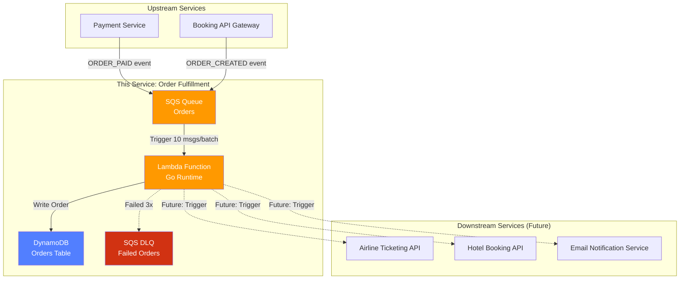
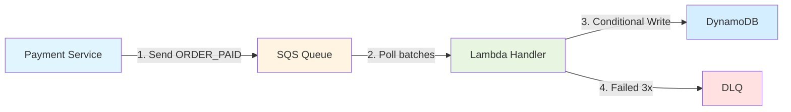

# Travel Order Fulfillment Service

A serverless order fulfillment microservice built with **AWS Lambda (Go)**, **SQS**, and **DynamoDB**. Handles asynchronous order processing for a travel booking platform with high scalability, fault tolerance, and exactly-once processing guarantees.

## Overview

This service acts as the **Order Fulfillment Layer** in a travel booking platform (similar to Expedia/Ctrip). When customers complete payment for travel packages (flights + hotels), this service ensures reliable order processing even during high-traffic periods (e.g., holiday sales).

### System Context



### Problem Statement

**Why asynchronous processing?**

When a customer pays for a flight+hotel package, multiple slow operations must happen:
- ✈️ Issue flight tickets via airline APIs (2-5 seconds)
- 🏨 Confirm hotel reservations (3-10 seconds)
- 📧 Send confirmation emails
- 📊 Update analytics/inventory systems

**Challenges:**
- **Slow APIs**: Airline systems respond in 2-5s, payment page would timeout
- **Unreliable dependencies**: Hotel APIs may be temporarily down
- **Traffic spikes**: Black Friday sales create 100x normal load
- **Exactly-once requirement**: Cannot issue duplicate flight tickets

**Solution:**
- Payment Service sends event to **SQS** (instant response)
- **Lambda** processes orders asynchronously with auto-scaling
- **DynamoDB** ensures idempotency with conditional writes
- **DLQ** isolates bad messages without blocking the pipeline

## Architecture

### High-Level Design



**Request Flow:**
1. **Upstream** → Payment Service publishes `ORDER_PAID` event to SQS
2. **SQS** → Buffers messages, triggers Lambda in batches of 10
3. **Lambda** → Validates, checks idempotency, persists order state
4. **DynamoDB** → Stores order with conditional write (prevents duplicates)
5. **DLQ** → Receives messages that failed 3 times for manual review

### Core Components

| Component | Purpose | Technology |
|-----------|---------|------------|
| **SQS Queue** | Buffer for order events, handles traffic spikes | Amazon SQS |
| **Lambda Handler** | Consumes messages, executes fulfillment logic | Go + AWS Lambda |
| **DynamoDB** | Stores order state with idempotency guarantees | DynamoDB (NoSQL) |
| **Dead Letter Queue** | Isolates failed messages for manual intervention | SQS DLQ |
| **Infrastructure** | Version-controlled infrastructure as code | Terraform |

## Project Structure

```
fulfillment-service/
├── cmd/
│   ├── lambda/            # Lambda entry point (deployed to AWS)
│   │   └── main.go        # Initializes dependencies, starts Lambda runtime
│   └── producer/          # Mock upstream service (local testing only)
│       └── main.go        # CLI tool to send test messages to SQS
│
├── internal/
│   ├── handler/           # Business logic layer
│   │   ├── handler.go     # Processes SQS events, orchestrates workflow
│   │   └── handler_test.go
│   ├── models/            # Domain models
│   │   └── order.go       # Order struct, validation, state machine
│   └── repository/        # Data access layer
│       └── dynamodb.go    # DynamoDB CRUD operations
│
├── terraform/             # Infrastructure as Code
│   └── main.tf            # Defines all AWS resources (SQS, Lambda, DynamoDB, IAM)
│
├── build.bat              # Windows build script (compiles Go → lambda.zip)
├── build.sh               # Linux/Mac build script
├── go.mod                 # Go module definition
└── README.md
```

**Key Files:**
- `cmd/lambda/main.go` → Packaged in `lambda.zip`, runs on AWS Lambda
- `cmd/producer/main.go` → Runs locally, sends test messages
- `terraform/main.tf` → Single file defines entire infrastructure
- `internal/handler/handler.go` → Core business logic (67 lines)

## Key Technical Highlights

### Performance Metrics
- **Cold Start**: ~100ms (Go binary)
- **Average Latency**: 50-150ms per order
- **Throughput**: 1000+ orders/sec with auto-scaling
- **Lambda Package Size**: ~1-2 MB (static binary)

### Cost Efficiency
- **Per 10,000 orders**: ~$0.02 (within free tier)
- **Idle cost**: $0 (serverless, pay-per-use)
- **Auto-scaling**: No manual capacity planning

### Reliability
- **Idempotency**: Conditional writes prevent duplicate processing
- **Retry Logic**: 3 automatic retries with exponential backoff
- **DLQ**: Failed messages isolated for manual review
- **At-Least-Once Delivery**: SQS guarantees message delivery

## Scope Boundaries (What This Service Does NOT Do)

- ❌ User authentication (handled by API Gateway upstream)
- ❌ Real integration with airlines/hotels (mocked or future work)
- ❌ Payment processing (upstream responsibility)
- ❌ Frontend UI
- ✅ Focus: Message consumption → Idempotent processing → State persistence → Failure handling

## Prerequisites

- Go 1.21+
- Terraform 1.5+
- AWS CLI configured with credentials
- AWS account with permissions for Lambda, SQS, DynamoDB, IAM

## Quick Start

### Prerequisites
- Go 1.21+
- AWS CLI configured (`aws configure`)
- Terraform 1.5+

### 1. Build Lambda Package
```bash
# Windows
build.bat

# Linux/Mac
chmod +x build.sh && ./build.sh
```

### 2. Deploy Infrastructure
```bash
cd terraform
terraform init
terraform apply
# Type 'yes' to confirm
```

**Output (example):**
```
sqs_queue_url = "https://sqs.us-east-1.amazonaws.com/<YOUR_ACCOUNT_ID>/fulfillment-service-orders-dev"
lambda_function_name = "fulfillment-service-order-processor-dev"
dynamodb_table_name = "fulfillment-service-orders-dev"
```

Copy the actual `sqs_queue_url` from your output.

### 3. Send Test Messages
```bash
cd ..

# Send 1 message
go run cmd/producer/main.go \
  --send \
  --queue-url <PASTE_SQS_URL>

# Send 100 messages at 10 msg/sec
go run cmd/producer/main.go \
  --send \
  --queue-url <PASTE_SQS_URL> \
  --count 100 \
  --interval 100ms
```

### 4. View Results

**Lambda Logs (CLI):**
```bash
aws logs tail /aws/lambda/fulfillment-service-order-processor-dev --follow
```

**DynamoDB Data (Console):**
1. Visit https://console.aws.amazon.com/dynamodb/
2. Tables → `fulfillment-service-orders-dev`
3. **Explore table items**

**CloudWatch Metrics (Console):**
1. Visit https://console.aws.amazon.com/lambda/
2. Click `fulfillment-service-order-processor-dev` → **Monitor**

### 5. Cleanup
```bash
cd terraform
terraform destroy
# Type 'yes' to confirm - deletes all resources
```

## Future Enhancements

- [ ] Add SNS fan-out for downstream services (airline, hotel, email)
- [ ] Implement saga pattern for distributed transactions
- [ ] Add API Gateway for synchronous order status queries
- [ ] Multi-region deployment with DynamoDB global tables
- [ ] Rate limiting per supplier (don't overwhelm airline APIs)

## License

MIT

---

**Last Updated**: 2026-02-28
